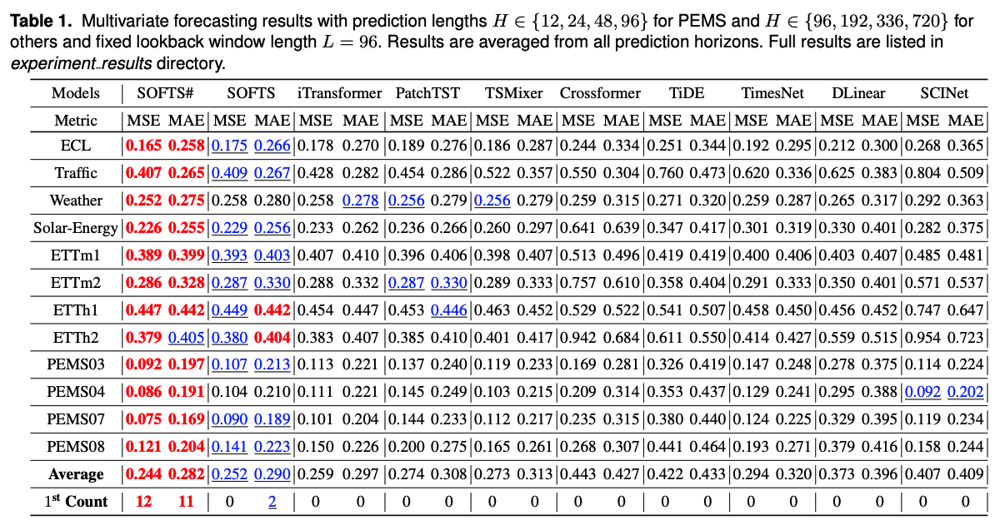

# [In Preparation] SOFTS#: A Continuation of SOFTS++

The code repository for SOFTS# (SOFTSsharp) in PyTorch. The manuscript is currently in preparation.

SOFTS# extends SOFTS with a stochastic variable-position encoding procedure and multiple dropout layers inside the aggregation-redistribution component, aiming to improve long-term forecasting accuracy while preserving linear computational complexity.

This work builds on the original SOFTS repository (https://github.com/Secilia-Cxy/SOFTS) and its SOFTS++ predecessor with minimal changes (https://github.com/hljubic/SOFTSpp).

The preceding SOFTS++ work has been published in *Intelligent Data Analysis*:
https://journals.sagepub.com/doi/10.1177/1088467X251380055

## Results

Full results are in the `experiment_results/` directory and image below.

## Datasets

You can directly download the datasets used in the paper from [Google Drive] (https://drive.google.com/drive/folders/1QPM7MMKlzVffdzbGGkzARDuIqiYRed_f?usp=drive_link) or [NJU Box](https://box.nju.edu.cn/d/abc2bbd7cff6461eb4da/). 

Once downloaded, place the datasets under folder `dataset/`, like `dataset/ETT-small`, `dataset/traffic`, etc.
